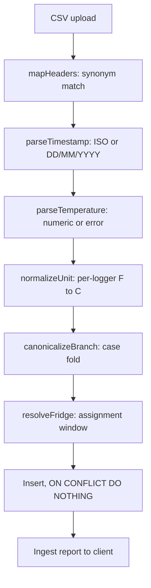

# Squanchy Bakery Fridge Monitor

## Repo layout

- `api/` - Express + TypeScript, `pg` driver, raw SQL (no ORM, no migration tool)
- `app/` - Expo React Native, TypeScript
- `data/` - sample logger CSVs in deliberately different shapes + generator script
- `docker-compose.yml` - Postgres 16 only
- `README.md`, `NOTES.md`, `PLAN.md`

## Data model

Postgres, applied from a single `api/src/db/schema.sql` on boot (idempotent `CREATE TABLE IF NOT EXISTS`).

- `branches` - `id`, `name`, `canonical_name` (folds `tel aviv` and `Tel Aviv` into one branch)
- `fridges` - `id`, `branch_id`, `name`, `threshold_c` default `5.0`
- `loggers` - `id`, `code` (`TL-0231`), `unit` (`C` or `F`) - this column is how Haifa gets fixed
- `logger_assignments` - `id`, `logger_id`, `fridge_id`, `valid_from`, `valid_to` nullable - this table is how the Tel Aviv logger moving into Display 2 is represented, instead of pretending a logger belongs to one fridge forever
- `readings` - `id`, `logger_id`, `fridge_id`, `recorded_at timestamptz`, `temp_c numeric` nullable, `raw_value text`, `status` (`ok` or `error`)
  - `UNIQUE (logger_id, recorded_at)` plus `ON CONFLICT DO NOTHING` - duplicate pasted rows are rejected by the database rather than by application code
- `uploads` - `id`, `filename`, `uploaded_at`, `rows_total`, `rows_accepted`, `rows_rejected`, `report jsonb`

Raw value is kept alongside the parsed one so `ERR` and a Fahrenheit original are auditable, which matters for an inspector-facing tool.

## Ingestion pipeline

Pure functions in `api/src/ingest/`, each one unit tested against a fixture built from Summer's own rows.

- `mapHeaders` - lowercase, strip punctuation, match synonym sets so moved and renamed columns still land: time/timestamp/date/datetime, temp/temperature/value/reading, logger/device/sensor/serial, branch/store/site/location, fridge/unit/cooler/asset. Unmapped columns are reported, not silently dropped.
- `parseTimestamp` - try ISO `2026-09-14 06:00` first, then `14/09/2026 06:00` as day-first. Day-first is an explicit assumption, written into NOTES, because `14/09` proves the Haifa logger is not month-first but a date like `03/04` would be ambiguous. Interpreted as `Asia/Jerusalem`, stored UTC.
- `parseTemperature` - non-numeric (`ERR`, empty, `--`) stores `status='error'` with `temp_c` null, so it counts toward data loss rather than being read as zero degrees.
- `normalizeUnit` - converts using the logger's declared unit; `TL-0231` seeded as `F`. Plus a sanity guard: if a logger declared `C` has a median reading above 20, the upload is rejected with "this looks like Fahrenheit" rather than storing a fridge at 38 degrees. An unguarded unit column is the kind of thing that silently poisons a year of data.
- Out-of-order rows (the `05:45` row sitting after `06:30`) need no special handling; ordering is a read-time `ORDER BY recorded_at`.
- If a file's fridge column disagrees with the current assignment, the file wins: close the old assignment row and open a new one, and surface it in the upload report as "TL-0417 appears to have moved to Display 2 on 2026-09-17, is that right?". Summer said she types the fridge name in by hand, so the file is the only signal a logger moved.

## Analysis engine

Pure functions in `api/src/analysis/`, operating on a sorted series. This is where Summer's actual sentence gets implemented: a jump for one reading is fine, a fridge slowly warming is not.

- `findExcursions(readings, thresholdC, minDurationMin = 30)` - contiguous runs above threshold lasting at least 30 minutes. Returns `start`, `end`, `durationMin`, `peakC`, `meanC`. The single `9.4` at Tel Aviv 06:15 does not qualify, by design.
- `findDoorEvents` - above-threshold runs shorter than the minimum, counted separately so they are visible as "3 door opens" without ever raising an alarm.
- `findGaps(readings, expectedIntervalMin = 15, gapFactor = 4)` - any hole over an hour becomes an explicit gap record. Rendered as a grey band in the chart and resolving to `no_data`, never to `ok`. Summer said she cannot tell a dead logger from a flat battery from a failed save, so the honest answer is to show the hole and label the cause unknown.
- `findDrift(readings, windowHours = 3, minSlopeCPerHour = 0.5)` - least-squares slope on a rolling window; sustained positive slope is a warning even while the fridge is still in range. Rishon runs 4.6, 5.4, 6.3, 7.1, roughly 3.3 degrees per hour, so this fires there. It is also the only rule that would have caught the dairy fridge in Rishon two days before the stock was thrown out.
- `fridgeStatus` - precedence `no_data` > `alarm` (excursion open now) > `warning` (drift, or an excursion that resolved inside the window) > `ok`.

Thresholds and windows live in one `api/src/analysis/config.ts` so they are reviewable in a single place and easy to argue about in the follow-up conversation.

## API

No auth, JSON, `api/src/routes/`.

- `POST /api/uploads` - multipart CSV via `multer`, returns the ingest report
- `GET /api/fridges` - every fridge with status and last reading, sorted worst-first
- `GET /api/fridges/:id?from=&to=` - reading series plus excursions, gaps, door events, drift
- `GET /api/reports/excursions?from=&to=&fridgeId=` - the literal inspector answer: when it went above five, and for how long
- `GET /api/health`

## App

Expo React Native, three tabs, `app/src/`. Expo rather than bare React Native because this machine has no full Xcode and no watchman, and because `npx expo start --web` lets a grader open the phone UI in a browser in about two minutes, which is the one hard constraint in the PDF.

- Dashboard - status-coloured fridge cards, worst first, pull to refresh. Summer is between branches and looking at a phone, so the first screen answers "is anything wrong" without scrolling.
- Fridge detail - line chart via `react-native-svg` (hand-rolled, roughly 80 lines; avoids chart libraries that break under Expo web), with a 5-degree threshold line, grey gap bands, red excursion bands, then a list of excursions with durations.
- Upload - `expo-document-picker`, then an ingest report view showing accepted, rejected, skipped duplicates, unmapped columns, and warnings. Summer is not technical, so a silent successful upload is worse than a noisy one.
- Inspector report - date range picker on the fridge detail screen, output as plain copyable text.

## Sample data

`data/` gets five CSVs in genuinely different shapes, plus `data/generate.ts` to pad to roughly 3000 rows to match the size Summer described:

- `jerusalem-dairy.csv` - clean ISO baseline
- `haifa-dairy.csv` - Fahrenheit, DD/MM/YYYY, contains `ERR`
- `telaviv-walkin.csv` - columns in a different order, contains the single-reading door spike
- `telaviv-display2.csv` - spans the 2026-09-17 logger move
- `rishon-creamcakes.csv` - the slow warming curve, and a two-hour gap

## Tests

`vitest` in `api/`, one fixture per trap, named so the mapping is obvious: Fahrenheit conversion, day-first dates, `ERR` rows, duplicate rejection, out-of-order input, column reordering, branch case folding, door spike not alarming, drift alarming, gap detection. These double as the "where in the repo can we see it" evidence the PDF asks for.

## Docs

- `README.md` - start Docker Desktop, `docker compose up -d`, `npm install && npm run dev` in `api/`, `npm install && npx expo start --web` in `app/`, then seed with `npm run seed`. Docker CLI is installed here but the daemon was not responding, so starting it is step one.
- `NOTES.md` - time spent; the unasked-for decisions (30-minute sustained rule, drift detection, day-first dates, Asia/Jerusalem, assignment windows, no auth); questions for Summer (do walk-in and cream-cake fridges share the 5-degree limit, what does the Ministry of Health actually require for duration, should she be alerted between uploads, who else needs access); what is unfinished; and one thing an AI tool got wrong with a pointer to where.
- `PLAN.md` - this plan, committed, since the PDF explicitly asks for planning notes in the repo.
